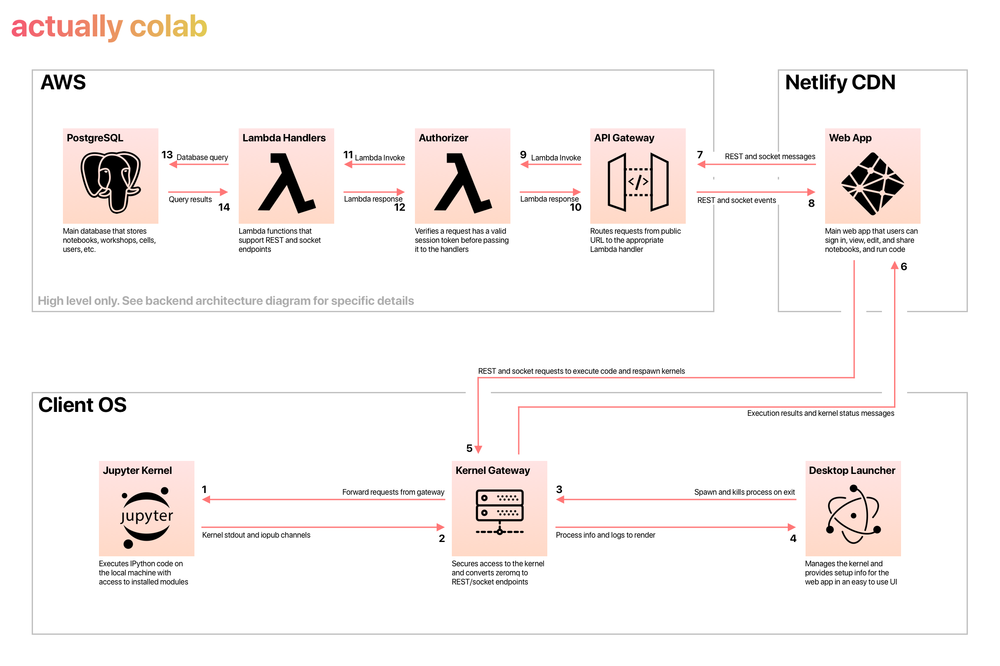

[](https://app.netlify.com/sites/actually-colab-app/deploys) [](https://github.com/actually-colab/desktop/actions/workflows/validation.yml) [](https://github.com/actually-colab/desktop/actions/workflows/bundle-reporter.yml)

 [](https://lgtm.com/projects/g/actually-colab/desktop/context:javascript)  [](https://github.com/actually-colab/desktop)  

[](https://opencollective.com/actuallycolab) [](https://www.patreon.com/actuallycolab) [](https://www.youtube.com/watch?v=ParNlHsbSrY) [](https://devpost.com/software/actually-colab-real-time-collaborative-jupyter-editor)

# desktop

   


<details>
<summary>Architecture Overview</summary>

This is a high level overview of our architecture.



</details>

## Motivation

The tools available for real time collaboration between individuals or small teams are often lacking or expensive. Our goal is to build a lightweight collaborative cloud-based Jupyter editor to allow individuals and teams to work on notebooks without the high price tag. The system should "just work" with minimal setup overhead and allow users to collaborate on projects anytime, anywhere. Rather than trying to build a full environment to execute code, we allow you to bring your own compute. You can execute code against your local machine or configure the editor to connect to a remote server if you need more horsepower. By allowing you to bring your own compute, we can focus on delivering a better collaboration experience without high costs. We build the editor from the ground up to create an experience that is familiar to Jupyter users but focuses on collaboration by design and stores everything in the cloud. Users can create notebooks, share them with their team, and edit together live. By separating the kernel to each user's machine instead of a shared server, you can run the code independently of other users and even view their results. If you need a deliverable notebook to submit or store in source control, you can export the notebook in the `ipynb` format straight from the editor.

## Repository Setup

### The Kernel

This process is started by the kernel hidden renderer process and communicates with the main process via IPC. Normally this is taken care of for you if you are using the desktop companion, but you may prefer to launch it manually if you run into issues or we don't support your platform.

#### Starting the Kernel Manually

```bash
jupyter notebook --NotebookApp.open_browser="False" --NotebookApp.allow_origin="*" --NotebookApp.token="CHOOSE A TOKEN VALUE"
```

> Setting the CORS Access-Control-Allow-Origin to `*` is generally a bad practice for security reasons. This will allow any website or malicious agent to execute code against your machine if they know what to look for. Instead, use the following origins depending on if you are in development or production:
>
> - Development: `http://localhost:4000`
> - Production: `https://app.actuallycolab.org`
>
> Similarly, you should choose a secure value for the token to make sure malicious clients can't connect to execute code

#### Stopping the Kernel

Run the following command to stop the kernel process:

```bash
jupyter notebook stop
```

If the kernel is running on a port other than the default `8888`, you can add the port to the end of the command.

To get a list of running ports you can run the following:

```bash
jupyter notebook list
```

### The Editor Client

In order to setup this repo, you also must clone the [editor repo](https://github.com/actually-colab/editor) and have the following directory structure:

- root
  - desktop
  - editor

## Setup Development

1. Clone and setup the `desktop` and `editor` repo with the above directory structure
2. Start the `editor/server`
3. Install and build the `editor/client` via `yarn install && yarn build`
4. Install the `desktop` dependencies via `yarn install`

If the `editor/client` changes, you can install the latest version in the `desktop` repo by running:

```bash
yarn upgrade:client
```

This will automatically pull the latest client (assuming proper directory structure), install and build it, remove it from `desktop` and add it back. This complicated process seems to be required from an issue where `yarn install` doesn't pick up the latest build of the local package.

### Environment

You need to create a file `.env.development.local`:

```
REACT_APP_GOOGLE_CLIENT_ID="<CHANGE_ME>"
```

Optionally you can also disable auto connecting during development to avoid spam:

```
REACT_APP_KERNEL_AUTO_CONNECT="off"
```

## Starting Development

1. Start the website locally to sign in (see: `www` repo)
2. Start the app in the `dev` environment:

   ```bash
   yarn start
   ```

## Deploying to Production

Create a file `.env.production.local`:

```
REACT_APP_GOOGLE_CLIENT_ID="<CHANGE_ME>"
REACT_APP_AC_API_URI="<CHANGE_ME>"
REACT_APP_AC_WS_URI="<CHANGE_ME>"
REACT_APP_SENTRY_DSN="<CHANGE_ME>"
```

Create a file `scripts/sentry.sh`:

```bash
#!/bin/bash
export SENTRY_AUTH_TOKEN="<CHANGE_ME>"
```

```bash
yarn deploy
```

## Docs

See [docs and guides here](https://docs.actuallycolab.org)

## Backers

Support us with monthly donations to help us continue development and keep the service free for all!

<a href="https://opencollective.com/actuallycolab/backer/0/website" target="_blank"></a>
<a href="https://opencollective.com/actuallycolab/backer/1/website" target="_blank"></a>
<a href="https://opencollective.com/actuallycolab/backer/2/website" target="_blank"></a>
<a href="https://opencollective.com/actuallycolab/backer/3/website" target="_blank"></a>
<a href="https://opencollective.com/actuallycolab/backer/4/website" target="_blank"></a>
<a href="https://opencollective.com/actuallycolab/backer/5/website" target="_blank"></a>
<a href="https://opencollective.com/actuallycolab/backer/6/website" target="_blank"></a>
<a href="https://opencollective.com/actuallycolab/backer/7/website" target="_blank"></a>
<a href="https://opencollective.com/actuallycolab/backer/8/website" target="_blank"></a>
<a href="https://opencollective.com/actuallycolab/backer/9/website" target="_blank"></a>
<a href="https://opencollective.com/actuallycolab/backer/10/website" target="_blank"></a>
<a href="https://opencollective.com/actuallycolab/backer/11/website" target="_blank"></a>
<a href="https://opencollective.com/actuallycolab/backer/12/website" target="_blank"></a>
<a href="https://opencollective.com/actuallycolab/backer/13/website" target="_blank"></a>
<a href="https://opencollective.com/actuallycolab/backer/14/website" target="_blank"></a>
<a href="https://opencollective.com/actuallycolab/backer/15/website" target="_blank"></a>
<a href="https://opencollective.com/actuallycolab/backer/16/website" target="_blank"></a>
<a href="https://opencollective.com/actuallycolab/backer/17/website" target="_blank"></a>
<a href="https://opencollective.com/actuallycolab/backer/18/website" target="_blank"></a>
<a href="https://opencollective.com/actuallycolab/backer/19/website" target="_blank"></a>
<a href="https://opencollective.com/actuallycolab/backer/20/website" target="_blank"></a>
<a href="https://opencollective.com/actuallycolab/backer/21/website" target="_blank"></a>
<a href="https://opencollective.com/actuallycolab/backer/22/website" target="_blank"></a>
<a href="https://opencollective.com/actuallycolab/backer/23/website" target="_blank"></a>
<a href="https://opencollective.com/actuallycolab/backer/24/website" target="_blank"></a>
<a href="https://opencollective.com/actuallycolab/backer/25/website" target="_blank"></a>
<a href="https://opencollective.com/actuallycolab/backer/26/website" target="_blank"></a>
<a href="https://opencollective.com/actuallycolab/backer/27/website" target="_blank"></a>
<a href="https://opencollective.com/actuallycolab/backer/28/website" target="_blank"></a>
<a href="https://opencollective.com/actuallycolab/backer/29/website" target="_blank"></a>

## Sponsors

Become a sponsor and we'll add your logo to our README and link to you on our website!

<a href="https://opencollective.com/actuallycolab/sponsor/0/website" target="_blank"></a>
<a href="https://opencollective.com/actuallycolab/sponsor/1/website" target="_blank"></a>
<a href="https://opencollective.com/actuallycolab/sponsor/2/website" target="_blank"></a>
<a href="https://opencollective.com/actuallycolab/sponsor/3/website" target="_blank"></a>
<a href="https://opencollective.com/actuallycolab/sponsor/4/website" target="_blank"></a>
<a href="https://opencollective.com/actuallycolab/sponsor/5/website" target="_blank"></a>
<a href="https://opencollective.com/actuallycolab/sponsor/6/website" target="_blank"></a>
<a href="https://opencollective.com/actuallycolab/sponsor/7/website" target="_blank"></a>
<a href="https://opencollective.com/actuallycolab/sponsor/8/website" target="_blank"></a>
<a href="https://opencollective.com/actuallycolab/sponsor/9/website" target="_blank"></a>
<a href="https://opencollective.com/actuallycolab/sponsor/10/website" target="_blank"></a>
<a href="https://opencollective.com/actuallycolab/sponsor/11/website" target="_blank"></a>
<a href="https://opencollective.com/actuallycolab/sponsor/12/website" target="_blank"></a>
<a href="https://opencollective.com/actuallycolab/sponsor/13/website" target="_blank"></a>
<a href="https://opencollective.com/actuallycolab/sponsor/14/website" target="_blank"></a>
<a href="https://opencollective.com/actuallycolab/sponsor/15/website" target="_blank"></a>
<a href="https://opencollective.com/actuallycolab/sponsor/16/website" target="_blank"></a>
<a href="https://opencollective.com/actuallycolab/sponsor/17/website" target="_blank"></a>
<a href="https://opencollective.com/actuallycolab/sponsor/18/website" target="_blank"></a>
<a href="https://opencollective.com/actuallycolab/sponsor/19/website" target="_blank"></a>
<a href="https://opencollective.com/actuallycolab/sponsor/20/website" target="_blank"></a>
<a href="https://opencollective.com/actuallycolab/sponsor/21/website" target="_blank"></a>
<a href="https://opencollective.com/actuallycolab/sponsor/22/website" target="_blank"></a>
<a href="https://opencollective.com/actuallycolab/sponsor/23/website" target="_blank"></a>
<a href="https://opencollective.com/actuallycolab/sponsor/24/website" target="_blank"></a>
<a href="https://opencollective.com/actuallycolab/sponsor/25/website" target="_blank"></a>
<a href="https://opencollective.com/actuallycolab/sponsor/26/website" target="_blank"></a>
<a href="https://opencollective.com/actuallycolab/sponsor/27/website" target="_blank"></a>
<a href="https://opencollective.com/actuallycolab/sponsor/28/website" target="_blank"></a>
<a href="https://opencollective.com/actuallycolab/sponsor/29/website" target="_blank"></a>

## Maintainers

- [Jeff Taylor-Chang](https://github.com/jtaylorchang)
- [Bailey Tincher](https://github.com/baileytincher)

## License

`@actually-colab/desktop` is [GPLv2 licensed](./LICENSE)
